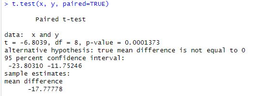

# Prak2_Probstat2023_C_5025211081

### Nama : Gabriella Natasya Br Ginting
### NRP  : 5025211081
### Kelas : Probstat C

<br>

- [Soal 1](#soal-1)
- [Soal 2](#soal-2)
- [Soal 3](#soal-3)
- [Soal 4](#soal-4)

## Soal 1
Seorang peneliti melakukan penelitian mengenai pengaruh aktivitas 𝐴 terhadap
kadar saturasi oksigen pada manusia. Peneliti tersebut mengambil sampel
sebanyak 9 responden. Pertama, sebelum melakukan aktivitas 𝐴, peneliti mencatat
kadar saturasi oksigen dari 9 responden tersebut. Kemudian, 9 responden tersebut
diminta melakukan aktivitas 𝐴. Setelah 15 menit, peneliti tersebut mencatat 
kembali kadar saturasi oksigen dari 9 responden tersebut. Berikut data dari 9 
responden mengenai kadar saturasi oksigen sebelum dan sesudah melakukan 
aktivitas.


Berdasarkan data pada tabel diatas, diketahui kadar saturasi oksigen dari
responden ke-3 ketika belum melakukan aktivitas 𝐴 sebanyak 67, dan setelah 
melakukan aktivitas 𝐴 sebanyak 70.

- A.  Carilah Standar deviasi dari data selisih pasangan pengamatan tabel diatas

Diketahui :
- x = (78, 75, 67, 77, 70, 72, 78, 70, 77)
- y = (100, 95, 70, 90, 90, 90, 89, 100, 100)

```
install.packages("BSDA")
library(BSDA)

x <- c(78, 75, 67, 77, 70, 72, 78, 70, 77)
y <- c(100, 95, 70, 90, 90, 90, 89, 100, 100)

difference <- y - x

sd(difference)
```
Keterangan:
- x : data responden mengenai kadar saturasi oksigen sebelum melakukan 
aktivitas
- y : data responden mengenai kadar saturasi oksigen sesudah melakukan 
aktivitas

`install.packages("BSDA")` dilakukan untuk menginstal package "BSDA". Package "BSDA" merupakan package yang digunakan untuk analisis statistik dalam bidang bioinformatika.

`library(BSDA)` untuk memanggil / memuat package "BSDA" ke dalam program yang kita buat, sehingga kita dapat menggunakan fungsi-fungsi yang disediakan oleh package tersebut.

Lalu, `x` dan `y` merupakan variable yang diinisialisasikan dengan vektor yang berisi data-data dari kadar saturasi oksigen sebelum dan sesudah melakukan aktivitas, sesuai dengan data yang diberikan dalam soal diatas.

Setelah, vektor x dan y diinisialisasikan, maka dicari selisih dari data kadar saturasi oksigen sebelum dan sesudah melakukan aktivitas. Dan disimpan pada variabel `difference`.

Untuk mendapatkan standar deviasi dari data selisih pasangan pengamatan tabel yang sudah dihitung sebelumnya, dapat menggunakan fungsi `sd()` yang berfungsi untuk mencari standar deviasinya (simpangan baku).

Hasil dari program :

```
7.838651
```

- B. Carilah nilai t (p-value)

Diketahui :
- x <- c(78, 75, 67, 77, 70, 72, 78, 70, 77)
- y <- c(100, 95, 70, 90, 90, 90, 89, 100, 100)

```
t.test(x, y, paired=TRUE)
```
Keterangan:
- x : data responden mengenai kadar saturasi oksigen sebelum melakukan 
aktivitas
- y : data responden mengenai kadar saturasi oksigen sesudah melakukan 
aktivitas

`t.test()` merupakan fungsi yang digunakan untuk melakukan uji t-test.

Pada fungsi diatas disertakan argumen `paired=TRUE` yang digunakan untuk mengindikasikan bahwa uji t yang dilakukan merupakan uji t berpasangan (paired t-test). 

Hal ini mengasumsikan bahwa setiap pasangan pengamatan dalam data kadar saturasi oksigen sebelum `(x)` dan sesudah `(y)` melakukan aktivitas saling terkait.

Program tersebut akan menjalankan fungsi t.test() yang akan menghitung statistik uji t, derajat kebebasan, dan nilai p (p-value) untuk uji hipotesis yang dilakukan.

Hasil dari program :



- C. Tentukanlah apakah terdapat pengaruh yang signifikan secara statistika dalam 
hal kadar saturasi oksigen , sebelum dan sesudah melakukan aktivitas 𝐴 jika 
diketahui tingkat signifikansi 𝛼 = 5% serta H0 : “tidak ada pengaruh yang
signifikan secara statistika dalam hal kadar saturasi oksigen sebelum dan sesudah 
melakukan aktivitas 𝐴”

-> Pada uji t didapatkan nilai p-value, yang dimana p-value merupakan probabilitas untuk mendapatkan hasil uji yang setidaknya se-ekstrem atau lebih ekstrem dibandingkan dengan apa yang diobservasi, jika hipotesis nol benar. 

Untuk dapat menentukan apakah terdapat pengaruh yang signifikan secara statistika dalam hal kadar saturasi oksigen, dapat dilihat dengan mengecek apakah nilai p-value kurang dari tingkat signifikansi α yang ditentukan (dalam hal ini, α = 0.05 atau 5%), maka kita dapat menolak hipotesis nol dan menyimpulkan bahwa terdapat pengaruh yang signifikan secara statistika dalam hal kadar saturasi oksigen sebelum dan sesudah melakukan aktivitas A. Jika nilai p-value lebih besar dari α, maka tidak cukup bukti untuk menolak hipotesis nol dan kita tidak dapat menyimpulkan bahwa terdapat pengaruh yang signifikan secara statistika.

Sehingga, dapat dilihat dari hasil uji t yang sudah dilakukan diatas terdapat nilai p-value sebesar `0.0001373` yang dimana memiliki nilai lebih kecil daripada nilai `α` yaitu `0.05`. Dengan penjelasan diatas, maka dapat diambil kesimpulan bahwa **terdapat pengaruh yang signifikan secara statistika dalam hal kadar saturasi oksigen , sebelum dan sesudah melakukan aktivitas 𝐴**.

## Soal 2
Diketahui bahwa mobil dikemudikan rata-rata lebih dari 25.000 kilometer per 
tahun. Untuk menguji klaim ini, 100 pemilik mobil yang dipilih secara acak 
diminta untuk mencatat jarak yang mereka tempuh. Jika sampel acak 
menunjukkan rata-rata 23.500 kilometer dan standar deviasi 3.000 kilometer
(kerjakan menggunakan library seperti referensi pada modul).

- A. Apakah Anda setuju dengan klaim tersebut? Jelaskan

-> Saya setuju, karena dengan klaim semata atau tanpa melakukan uji z-sum dapat diberi klaim bahwa memungkinkan saja apabila mobil dikemudikan rata-rata lebih dari 25.000 kilometer per tahun.

Namun, untuk mendapatkan kesimpulan yang sesuai data, dapat digunakan uji z-sum pada program dibawah.

- B. Buatlah kesimpulan berdasarkan p-value yang dihasilkan!

Diketahui :
- x = 23500
- sigma = 3000
- n = 100
- mu = 25000

```
x <- 23500
sigma <- 3000
n <- 100

zsum.test(x, sigma, n, alternative = "greater", mu = 25000)
```
Keterangan:
- x = mean(rata-rata) dari sampel
- sigma = standar deviasi populasi
- n = jumlah sampel
- mu = nilai klaim(nilai rata-rata yang diuji)

Pada program diatas digunakan fungsi `zsum.test()`, dikarenakan soal memberi informasi mengenai standar deviasi populasi. Dan apabila soal tidak memberikan informasi mengenai standar deviasi, maka harus menggunakan fungsi `t.test()`.

Pada hasil uji z-sum didapatkan nilai p-value = 1 yang dimana artinya nilai p-value lebih besar daripada nilai α yaitu 0.05.

Sehingga, dapat ditarik kesimpulan bahwa tidak cukup bukti untuk menolak hipotesis nol atau hipotesis alternatif. Hipotesis nol menyatakan bahwa tidak ada pengaruh yang signifikan secara statistika (**rata-rata jarak tempuh mobil lebih dari 25.000 kilometer per tahun**).


## Soal 3
Diketahui perusahaan memiliki seorang data analyst yang ingin memecahkan
permasalahan pengambilan keputusan dalam perusahaan tersebut. Selanjutnya
didapatkanlah data berikut dari perusahaan saham tersebut.


Dari data di atas berilah keputusan serta kesimpulan yang didapatkan. Asumsikan 
nilai variancenya sama, apakah ada perbedaan pada rata-ratanya (α= 0.05)? 
Buatlah:

- A. H0 dan H1

```
H0 : µ1 = µ2 (rata-rata saham Bandung sama dengan Bali)
H1 : µ1 ≠ µ2 (rata-rata saham Bandung tidak sama dengan Bali)
```

- B. Hitung sampel statistik

Diketahui :
- n1 = 20
- n2 = 27
- x1 = 3.64
- x2 = 2.79
- sd1 = 1.67
- sd2 = 1.5

```
n1 <- 20
n2 <- 27

x1 <- 3.64
x2 <- 2.79

sd1 <- 1.67
sd2 <- 1.5

tsum.test(x1, sd1, n1, x2, sd2, n2, alternative = "greater", var.equal = TRUE)
```
Keterangan:
- n1 : jumlah saham di Bandung
- n2 : jumlah saham di Bali
- x1 : sampel mean di Bandung
- x2 : sampel mean di Bali
- sd1 : sampel standar deviasi di Bandung
- sd2 : sampel standar deviasi di Bali

`tsum.test` digunakan uji t-test untuk menghasilkan output yang mencakup nilai t-statistik, p-value, dan interval kepercayaan. Dengan nilai p-value yang diberikan dapat ditentukan apakah ada perbedaan yang signifikan pada rata-rata antara kedua kelompok.

`alternative = "greater"` digunakan untuk mengindikasikan bahwa hipotesis alternatif adalah rata-rata kelompok pertama lebih besar dari rata-rata kelompok kedua. Ini akan menguji apakah ada perbedaan pada rata-rata antara kedua kelompok.

`var.equal = TRUE` digunakan untuk mengindikasikan bahwa asumsi yang dilakukan yaitu variancenya sama di antara kedua kelompok.

Hasil dari program :


- C. Lakukan uji statistik (df =2)

Diketahui :
- df = 2
- dist = t

```
install.packages("mosaic")
library(mosaic)

df <- 2
plotDist(dist = 't', df, col = "blue")
```
Keterangan :
- df = derajat kebebasan (degrees of freedom) dalam distribusi t-student

Fungsi yang digunakan adalah fungsi `plotDist()` dari library `mosaic` untuk membuat plot distribusi t-student dengan derajat kebebasan (degrees of freedom) yang sudah di tentukan.

`dist = t` untuk menentukan bahwa jenis distribusi yang akan digunakan adalah distribusi t-student. `col = "blue"` digunakan untuk menentukan warna garis plot distribusi.

Program diatas akan menghasilkan plot distribusi t-student dengan derajat kebebasan 2. Plot ini akan memberikan visualisasi tentang bentuk dan karakteristik distribusi t-student dengan derajat kebebasan yang ditentukan.

Distribusi t-student digunakan dalam uji t-test ketika ukuran sampel relatif kecil atau ketika variasi populasi tidak diketahui. Melalui plot distribusi ini, kita dapat melihat bagaimana nilai t-statistik dan p-value terkait dengan distribusi t-student untuk derajat kebebasan yang diberikan.

Hasil dari program :


- D. Nilai kritikal

Diketahui :
- df = 2
- p = 0.05

```
df <- 2
p <- 0.05

qchisq(p, df, lower.tail = FALSE)
```
Keterangan:
- df = derajat kebebasan (degrees of freedom) dalam distribusi t-student
- p = tingkat signifikansi yang ditentukan

Fungsi yang digunakan adalah fungsi `qchisq()` untuk menghitung nilai kritikal dari distribusi chi-square. 

`lower.tail = FALSE` digunakan untuk menentukan bahwa kita ingin mencari nilai kritikal pada ekor atas distribusi chi-square.

Kode diatas akan dijalankan untuk menghasilkan nilai kritikal dari distribusi chi-square dengan derajat kebebasan 2 pada tingkat signifikansi 0.05.

Hasil dari program :

```
5.991465
```

- E. Keputusan

->  Pada soal bagian b didapatkan nilai p-value sebesar 0.03691 yang dimana nilai tersebut lebih kecil dibandingkan nilai signifikan yaitu 0.05. Sehingga, H0 dapat ditolak dan H1 diterima.

- F. Kesimpulan

-> Karena hasil nilai p-value lebih kecil dan mengakibatkan H0 dapat ditolak dan H12 diterima, maka dapat ditarik kesimpulan bahwa adanya perbedaan rata-rata saham Bandung dengan Bali.

## Soal 4
Data yang digunakan merupakan hasil eksperimen yang dilakukan untuk 
mengetahui pengaruh suhu operasi (100˚C, 125˚C dan 150˚C) dan tiga jenis kaca 
pelat muka (A, B dan C) pada keluaran cahaya tabung osiloskop. Percobaan 
dilakukan sebanyak 27 kali dan didapat data sebagai berikut:
https://drive.google.com/file/d/1pICtCrf61DRU86LDPQDJmcKiUMVt9ht4/view. 

Dengan data tersebut:

- A. Buatlah plot sederhana untuk visualisasi data.


```
install.packages("multcompView")
library(readr)
library(ggplot2)
library(multcompView)
library(dplyr)

data <- read_csv("GTL.csv")
head(data)

str(data)

qplot(x = Temp, y = Light, geom = "point", data = data) + facet_grid(.~Glass, labeller = label_both)
```
Keterangan:
- install.packages("multcompView") = perintah untuk menginstal library "multcompView"
- library(readr) = perintah untuk memuat library "readr", yang digunakan untuk membaca file CSV
- library(ggplot2) = perintah untuk memuat library "ggplot2", yang digunakan untuk membuat plot
- library(multcompView) = perintah untuk memuat library "multcompView", yang digunakan untuk mengelola kontras dan visualisasi
- library(dplyr) = perintah untuk memuat library "dplyr", yang digunakan untuk melakukan operasi manipulasi data

`data <- read_csv("GTL.csv")` merupakan perintah yang digunakan untuk membaca file CSV dengan nama "GTL.csv" yang sudah di download sebelumnya dan berada pada direktori yang sama dengan working directory saat ini lalu menyimpan datanya ke dalam variabel `data`.

`head(data)` digunakan untuk menampilkan beberapa baris pertama dari data untuk memeriksa apakah data telah terbaca dengan benar.

`str(data)` digunakan untuk menampilkan struktur data, termasuk tipe data dan struktur kolom.

Fungsi `qplot()` digunakan untuk membuat plot dari library "ggplot2". Pada plot tersebut akan menghasilkan tampilan berupa hubungan antara suhu operasi (Temp) dan keluaran cahaya (Light) pada tabung osiloskop, dengan masing-masing jenis kaca pelat muka (Glass) ditampilkan dalam grid terpisah. 

`geom = "point"` digunakan untuk menunjukkan bahwa titik akan digunakan dalam plot.

Hasil dari program :

- Data


- str(data)


- B. Lakukan uji ANOVA dua arah.

```
data$Glass = as.factor(data$Glass)
data$Temp_Factor = as.factor(data$Temp)

str(data)

anova = aov(Light ~ Glass*Temp_Factor, data = data)

summary(anova)

```
Keterangan :
- `data$Glass = as.factor(data$Glass)` = perintah untuk mengubah kolom "Glass" dalam dataset menjadi factor, sehingga memperlakukan nilai-nilainya sebagai kategori atau factor.
- `data$Temp_Factor = as.factor(data$Temp)` = perintah untuk mengubah kolom "Temp" dalam dataset menjadi factor, sehingga memperlakukan nilai-nilainya sebagai kategori atau factor.

`str(data)` digunakan untuk menampilkan struktur dataset, termasuk tipe data dan struktur kolom. Ini membantu memeriksa apakah perubahan tipe data telah berhasil dilakukan.

Fungsi `aov` digunakan untuk melakukan uji ANOVA dua arah dan untuk memodelkan hubungan antara keluaran cahaya (Light) dengan interaksi antara jenis kaca pelat muka (Glass) dan suhu operasi (Temp). 

`Light ~ Glass*Temp_Factor` digunakan untuk menunjukkan bahwa keluaran cahaya bergantung pada faktor jenis kaca pelat muka dan faktor suhu operasi, serta interaksi antara keduanya. 

`data = data` digunakan untuk menunjukkan bahwa data yang digunakan adalah dataset yang telah dimuat sebelumnya.

`summary(anova)` digunakan untuk memberikan summary hasil uji ANOVA dua arah yang disimpan dalam variabel `anova`. Summary ini meliputi nilai-nilai F-statistik, nilai p-value, dan kesimpulan mengenai signifikansi pengaruh faktor-faktor yang diuji.

Hasil dari program :


- C. Tampilkan tabel dengan mean dan standar deviasi keluaran cahaya untuk setiap 
perlakuan (kombinasi kaca pelat muka dan suhu operasi)

```
data_summary = group_by(data, Glass, Temp) %>%

  summarise(mean = mean(Light), sd = sd(Light)) %>%
  arrange(desc(mean))

print(data_summary)
```
Keterangan :

`data_summary = group_by(data, Glass, Temp) %>%` digunakan untuk mengelompokkan data berdasarkan kolom "Glass" dan "Temp" menggunakan fungsi `group_by(). %>%` yang dimana digunakan juga untuk menyambungkan operasi berikutnya dalam rangkaian pipa.

`summarise(mean = mean(Light), sd = sd(Light)) %>%` digunakan untuk menghitung mean dan sd dari kolom "Light" untuk setiap kelompok yang telah dikelompokkan sebelumnya menggunakan fungsi `summarise(). %>%` yang digunakan kembali untuk menyambungkan operasi berikutnya dalam rangkaian pipa.

`arrange(desc(mean))` digunakan untuk mengurutkan hasil berdasarkan kolom "mean" secara menurun (descending order), sehingga hasilnya akan diurutkan mulai dari yang tertinggi.

`print(data_summary)` digunakan untuk mencetak atau menampilkan tabel hasil summary yang telah dihasilkan.

Hasil dari program :

